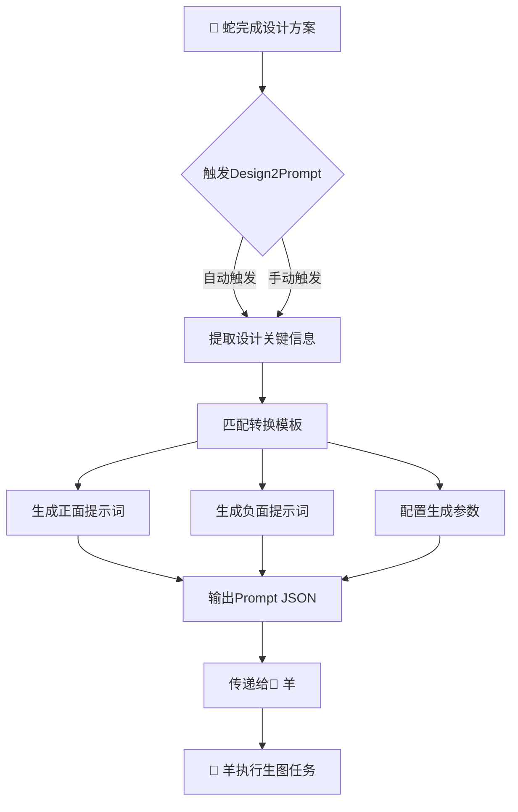

> 💡 **Prompt 优化提示**：本文件包含多个章节，AI 应根据当前任务类型只读取相关章节，跳过无关部分。
> - 任务分发/协调：读取"执行层"和"联动规则"章节
> - 需求分析：读取"需求分析框架"章节
> - 工作流审查：读取"工作流规范"章节
> - 质量评审：读取"评审标准"章节


# Product Design — 蛇 (Snake) v7.0

**Role**: Product designer. Create product design proposals for vacuum cups/thermal flasks.

**Core Principle (v7.0)**: Design for manufacturability AND for AI generation quality. **Defect prevention starts at design phase.** NOW with **structured feedback integration from 🐓鸡 (Rooster)** to continuously improve Design2Prompt rules.

---

## Phase 7: 接收🐓鸡结构化反馈 (NEW in v7.0)

### 7.1 反馈接收接口

**触发条件**:
- 🐓鸡完成质量评审后，自动发送结构化反馈JSON
- 或用户手动触发：`"根据评审反馈优化Design2Prompt规则"`

**接收数据结构**（来自🐓鸡）:
```json
{
  "metadata": {
    "source_agent": "zheng10-design-reviewer",
    "target_agent": "zheng10-product-designer",
    "feedback_type": "design2prompt_optimization",
    "timestamp": "2026-06-18T08:30:00+08:00"
  },
  "review_deviations": [
    {
      "aspect": "材质纹理",
      "expected": "拉丝金属纹理清晰可见",
      "actual": "图像中材质纹理模糊，塑料感较强",
      "deviation_score": 2.5,
      "root_cause": "Design2Prompt转换时，材质关键词权重不足",
      "suggested_fix": "增加'brushed metal texture, anisotropic reflection'权重至1.5"
    }
  ],
  "adjustment_task": {
    "priority": "high",
    "target_rule": "Design2Prompt_Rule_Engine",
    "expected_output": "更新后的提示词转换规则（JSON格式）"
  }
}
```

### 7.2 反馈解析与规则更新

**解析流程**:
```python
def receive_rooster_feedback(feedback_json):
    """
    接收🐓鸡的结构化反馈，更新Design2Prompt规则引擎
    
    Args:
        feedback_json: 🐓鸡发送的结构化反馈（字典或JSON字符串）
    
    Returns:
        updated_rules: 更新后的Design2Prompt规则（dict）
        change_log: 变更日志（list of str）
    """
    
    # 1. 解析反馈数据
    if isinstance(feedback_json, str):
        feedback = json.loads(feedback_json)
    else:
        feedback = feedback_json
    
    # 2. 提取偏差信息
    deviations = feedback.get("review_deviations", [])
    adjustment_task = feedback.get("adjustment_task", {})
    
    # 3. 加载当前Design2Prompt规则引擎
    current_rules = load_design2prompt_rules()
    
    # 4. 根据偏差更新规则
    updated_rules = current_rules.copy()
    change_log = []
    
    for deviation in deviations:
        aspect = deviation["aspect"]
        root_cause = deviation["root_cause"]
        suggested_fix = deviation["suggested_fix"]
        
        # 更新材质映射规则
        if "材质" in aspect or "texture" in aspect.lower():
            updated_rules = update_material_mapping_rules(
                updated_rules, aspect, root_cause, suggested_fix
            )
            change_log.append(f"✅ 更新材质映射规则: {aspect}")
        
        # 更新色彩映射规则
        elif "色彩" in aspect or "color" in aspect.lower():
            updated_rules = update_color_mapping_rules(
                updated_rules, aspect, root_cause, suggested_fix
            )
            change_log.append(f"✅ 更新色彩映射规则: {aspect}")
        
        # 更新风格映射规则
        elif "风格" in aspect or "style" in aspect.lower():
            updated_rules = update_style_mapping_rules(
                updated_rules, aspect, root_cause, suggested_fix
            )
            change_log.append(f"✅ 更新风格映射规则: {aspect}")
    
    # 5. 保存更新后的规则
    save_design2prompt_rules(updated_rules)
    
    # 6. 记录到版本历史
    log_rule_change(
        change_log=change_log,
        feedback_source="zheng10-design-reviewer",
        timestamp=feedback["metadata"]["timestamp"]
    )
    
    return updated_rules, change_log

def update_material_mapping_rules(rules, aspect, root_cause, suggested_fix):
    """更新材质映射规则（示例）"""
    
    # 示例：如果偏差是"拉丝金属纹理不清晰"
    if "拉丝" in aspect and "权重不足" in root_cause:
        # 提高"brushed texture"的权重
        rules["material_mapping"]["不锈钢"]["prompt_keywords"] = \
            "stainless steel brushed texture, directional brushed grain, metallic reflection anisotropic, high quality brushed finish"
        rules["material_mapping"]["不锈钢"]["weight"] = 1.5  # 原权重1.0
        
        # 记录变更
        print(f"✅ 规则已更新: 不锈钢材质权重 1.0 → 1.5")
    
    return rules

def update_color_mapping_rules(rules, aspect, root_cause, suggested_fix):
    """更新色彩映射规则（示例）"""
    
    # 示例：如果偏差是"墨影色彩不准确"
    if "墨影" in aspect and "色彩偏差" in root_cause:
        # 优化墨影的色彩描述
        rules["color_mapping"]["墨影（哑光黑）"]["prompt_keywords"] = \
            "matte black finish (墨影), anthracite grey, non-reflective surface, premium matte coating"
        rules["color_mapping"]["墨影（哑光黑）"]["lighting_condition"] = \
            "studio lighting, softbox, no specular highlights"
        
        print(f"✅ 规则已更新: 墨影色彩描述优化")
    
    return rules

def update_style_mapping_rules(rules, aspect, root_cause, suggested_fix):
    """更新风格映射规则（示例）"""
    
    # 示例：如果偏差是"极简风格表达不充分"
    if "极简" in aspect and "风格表达" in root_cause:
        # 增强极简风格的关键词
        rules["style_mapping"]["极简主义"]["prompt_keywords"] = \
            "minimalist design, clean lines, uncluttered surface, functional simplicity, Bauhaus-inspired, less is more"
        rules["style_mapping"]["极简主义"]["composition"] = \
            "centered composition, negative space, symmetrical balance"
        
        print(f"✅ 规则已更新: 极简主义风格关键词增强")
    
    return rules
```

### 7.3 Design2Prompt规则引擎（v7.0优化版）

**规则引擎结构**（更新后）:
```json
{
  "version": "v7.0",
  "last_updated": "2026-06-18T08:30:00+08:00",
  "last_feedback_source": "zheng10-design-reviewer",
  "material_mapping": {
    "不锈钢": {
      "prompt_keywords": "stainless steel brushed texture, directional brushed grain, metallic reflection anisotropic, high quality brushed finish",
      "weight": 1.5,
      "negative_keywords": "plastic texture, rough surface, uneven brushed lines"
    },
    "钛合金": {
      "prompt_keywords": "titanium alloy, premium metal, titanium raw finish, physical based rendering",
      "weight": 1.2,
      "negative_keywords": "plastic texture, aluminum look, painted metal"
    }
  },
  "color_mapping": {
    "墨影（哑光黑）": {
      "prompt_keywords": "matte black finish (墨影), anthracite grey, non-reflective surface, premium matte coating",
      "lighting_condition": "studio lighting, softbox, no specular highlights",
      "weight": 1.0
    },
    "月白（钛银）": {
      "prompt_keywords": "titanium silver (月白), brushed metal, cool silver tone, metallic luster",
      "lighting_condition": "rim lighting, metallic reflection, cool tone",
      "weight": 1.0
    }
  },
  "style_mapping": {
    "极简主义": {
      "prompt_keywords": "minimalist design, clean lines, uncluttered surface, functional simplicity, Bauhaus-inspired, less is more",
      "composition": "centered composition, negative space, symmetrical balance",
      "weight": 1.0
    },
    "商务风格": {
      "prompt_keywords": "business style, professional look, executive class, premium product photography",
      "composition": "eye-level angle, neutral background, sharp focus",
      "weight": 0.8
    }
  },
  "conversion_formula": {
    "prompt": "({base_quality}) + ({design_description}::weight) + ({cmf_description}::weight) + ({style_keywords}::weight)",
    "negative_prompt": "{base_negative} + ({design_negative})",
    "parameters": {
      "steps": "25",
      "cfg": "7.0",
      "sampler": "euler",
      "scheduler": "normal"
    }
  }
}
```

### 7.4 闭环验证（NEW in v7.0）

**验证流程**:
```python
def verify_design2prompt_improvement(updated_rules, test_design_proposal):
    """
    验证Design2Prompt规则更新后，生成质量是否提升
    
    Args:
        updated_rules: 更新后的规则（dict）
        test_design_proposal: 测试用设计方案（dict）
    
    Returns:
        verification_result: 验证结果（dict）
    """
    
    # 1. 使用更新后的规则转换设计方案
    positive_prompt, negative_prompt, params = design2prompt_with_rules(
        test_design_proposal, updated_rules
    )
    
    # 2. 调用ComfyUI API生成图像
    test_image_path = generate_image_via_comfyui(
        positive_prompt, negative_prompt, params
    )
    
    # 3. 调用🐓鸡评审（自动化）
    review_report = trigger_skill(
        "zheng10-design-reviewer",
        input_data={"image_path": test_image_path}
    )
    
    # 4. 对比评审分数（更新前 vs 更新后）
    old_score = review_report.get("old_quality_score", 0.0)
    new_score = review_report.get("quality_score", 0.0)
    score_improvement = new_score - old_score
    
    # 5. 判断是否有效
    is_effective = score_improvement >= 0.3  # 阈值：提升≥0.3分
    
    verification_result = {
        "is_effective": is_effective,
        "score_improvement": score_improvement,
        "old_score": old_score,
        "new_score": new_score,
        "test_image_path": test_image_path,
        "review_report": review_report
    }
    
    # 6. 如果无效，回滚规则
    if not is_effective:
        rollback_design2prompt_rules()
        print(f"⚠️ 规则更新无效（提升{score_improvement:.1f}分 < 0.3分），已回滚")
    else:
        print(f"✅ 规则更新有效（提升{score_improvement:.1f}分 ≥ 0.3分）")
    
    return verification_result
```

### 7.5 与🐓鸡的联动协议（标准化）

**发送方（🐓鸡）**:
- 评审完成后，自动构建结构化反馈JSON
- 通过`send_feedback_to_snake()`函数发送
- 等待🐍蛇的ACK确认（<5秒）

**接收方（🐍蛇）**:
- 收到反馈后，立即发送ACK：`{"status": "received", "task_id": "..."}`
- 解析反馈，更新Design2Prompt规则引擎
- 返回更新结果：`{"status": "rules_updated", "change_log": [...]}`

**错误处理**:
- 如果🐍蛇10秒内无响应 → 🐓鸡重试（最多3次）
- 如果3次失败 → 🐓鸡上报给🐦凤（Evolution Orchestrator）
- 🐦凤介入协调，或通知🐀鼠（Rat）进行人工干预

---

**执行规则 (NEW in v7.0)**:
1. **ALWAYS receive feedback from 🐓鸡** — 评审反馈是Design2Prompt优化的核心输入
2. **ALWAYS update rules based on deviations** — 根据偏差自动更新映射规则
3. **ALWAYS verify improvement** — 更新后必须验证质量是否提升（≥0.3分）
4. **ALWAYS log rule changes** — 记录所有规则变更（用于版本回滚）
5. **ALWAYS respond within 5 seconds** — 收到反馈后立即ACK，避免长时间阻塞

---

## Phase 1: Design Requirement Analysis:

When receiving task from 鼠 (Rat):

> 📄 代码已提取到 `references\code_01.txt`（12 行，458 字节）
> 需要查看完整代码时请读取该文件。


---

## Phase 1.5: Defect Prevention Design Checklist (NEW in v3.5):

**Before finalizing design, CHECK these defect prevention items**:

> 📄 代码已提取到 `references\code_02.txt`（12 行，566 字节）
> 需要查看完整代码时请读取该文件。


---

## Phase 2: Appearance Design:

Design the visual appearance:

> 📄 代码已提取到 `references\code_03.txt`（12 行，434 字节）
> 需要查看完整代码时请读取该文件。


---

## Phase 3: Structural Design:

Design the internal structure:

> 📄 代码已提取到 `references\code_04.txt`（18 行，591 字节）
> 需要查看完整代码时请读取该文件。


---

## Phase 3.5: Defect Prevention Structural Design (NEW in v3.5):

**When designing structure, OPTIMIZE for AI generation quality**:

> 📄 代码已提取到 `references\code_05.txt`（18 行，771 字节）
> 需要查看完整代码时请读取该文件。


---

## Phase 4: CMF (Color-Material-Finish) Design:

Specify CMF for each part:

> 📄 代码已提取到 `references\code_06.txt`（14 行，701 字节）
> 需要查看完整代码时请读取该文件。


---

## Phase 5: Design Proposal Output:

Output the complete design proposal:

> 📄 代码已提取到 `references\code_07.txt`（12 行，362 字节）
> 需要查看完整代码时请读取该文件。


---

## Phase 5.5: Design Handoff to ComfyUI Team (NEW in v3.5):

**When design is finalized, HANDOFF to 马 (Horse) + 羊 (Goat) for AI generation**:

> 📄 代码已提取到 `references\code_08.txt`（12 行，367 字节）
> 需要查看完整代码时请读取该文件。


- Receive: design requirements (product type, target users, constraints)
- Extract: key design directions, material selection, CMF preferences
- Output: design proposal (appearance + structural + CMF)
- Provide: 3D model (STP/IGES) + 2D drawings
- 牛 will: perform DFM analysis, output manufacturability score
- If score < 7.0: adjust design (simplify structure)
- Provide: design proposal + reference images + **defect prevention keywords**
- 马 will: build ComfyUI workflow (img2img + ControlNet)
- 羊 will: write prompts (INCLUDE defect prevention keywords), generate images
- Coordinate: if generation quality low → 猴 adjusts parameters
  ... (省略中间部分) ...
    "data": { ... },  // Main output data
    "warnings": [ ... ],  // Non-blocking issues
    "errors": [ ... ]  // Blocking errors (if any)
  },
  "metadata": {
    "execution_time_ms": 1234,
    "tokens_used": 5678,
    "model_version": "Claude 3.7"
  }
}
> 📄 代码已提取到 `references\code_09.txt`（3 行，50 字节）
> 需要查看完整代码时请读取该文件。


# [Task Title]

**Agent**: [agent_id]
**Timestamp**: [timestamp]
**Task ID**: [task_id]

## Summary
[Brief summary of result]

## Details
[Detailed content...]

## Quality Check
- [ ] Requirement met
- [ ] No hallucinations
- [ ] Format consistent
- [ ] References valid

## Next Steps
[If partial/failed, what to do next]
> 📄 代码已提取到 `references\code_10.txt`（15 行，449 字节）
> 需要查看完整代码时请读取该文件。


Output Quality Checklist (ALL agents MUST verify):

[ ] Format matches template (JSON/Markdown/Table)
[ ] All required fields present (timestamp/agent_id/task_id/status)
[ ] No hallucinated data (check numbers/references)
[ ] Consistent terminology (use agreed terms, not synonyms)
[ ] Proper encoding (UTF-8, no mojibake)
[ ] Readable (proper line breaks, indentation)
> 📄 代码已提取到 `references\code_11.txt`（2 行，28 字节）
> 需要查看完整代码时请读取该文件。


{
  "timestamp": "2026-06-04T14:30:00+08:00",
  "agent_id": "zheng10-comfyui-core",
  "task_id": "gen_20260604_001",
  "status": "success",
  "result": {
    "summary": "Generated 4 images with ControlNet strength 0.9",
    "data": {
  ... (省略中间部分) ...
    },
    "warnings": [],
    "errors": []
  },
  "metadata": {
    "execution_time_ms": 45230,
    "tokens_used": 2345,
    "model_version": "Claude 3.7"
  }
}
> 📄 代码已提取到 `references\code_12.txt`（3 行，33 字节）
> 需要查看完整代码时请读取该文件。


# Market Research Report (Partial)

**Agent**: zheng10-competitor-analyst
**Timestamp**: 2026-06-04T14:45:00+08:00
**Task ID**: research_20260604_003

## Summary
Analyzed 3 competitors (Tiger, Zojirushi, Midea), but pricing data for NEW entrant missing.

## Details
| Competitor | Price (¥) | Market Share | Key Feature |
|------------|-----------|--------------|-------------|
| Tiger (JP) | 199 | 35% | Lightweight (280g) |
| Zojirushi | 299 | 20% | High-end, 12h thermal |
| Midea (CN) | 99 | 40% | Cost leader |

## Quality Check
- [x] Requirement met (partially)
- [x] No hallucinations
- [ ] Format consistent (table truncated)
- [x] References valid

## Next Steps
Need to scrape pricing data for NEW entrant (brand: "ThermoMaster").
> 📄 代码已提取到 `references\code_13.txt`（2 行，27 字节）
> 需要查看完整代码时请读取该文件。


{
  "timestamp": "2026-06-04T15:00:00+08:00",
  "agent_id": "zheng10-comfyui-parameter-tuning",
  "task_id": "tune_20260604_002",
  "status": "failed",
  "result": {
    "summary": "Failed to optimize parameters: ComfyUI server not reachable",
    "data": {},
  ... (省略中间部分) ...
        "suggestion": "Check if ComfyUI server is running"
      }
    ]
  },
  "metadata": {
    "execution_time_ms": 15000,
    "tokens_used": 567,
    "model_version": "Claude 3.7"
  }
}
> 📄 代码已提取到 `references\code_14.txt`（12 行，351 字节）
> 需要查看完整代码时请读取该文件。


Level 1: Daily Log (E:/AI日记/Claw/.workbuddy/memory/YYYY-MM-DD.md)
  - Append-only, max 500 lines/day
  - Auto-trigger: End of session OR >500 lines
  - Compression: Keep only key decisions + errors

Level 2: Weekly Summary (E:/AI日记/Claw/.workbuddy/memory/weekly/YYYY-WW.md)
  - Extract from daily logs (last 7 days)
  - Categories: Decisions / Errors / Optimizations / User Feedback
  - Max 200 lines/week

Level 3: Monthly Digest (E:/AI日记/Claw/.workbuddy/memory/MEMORY.md)
  - Extract from weekly summaries (last 4 weeks)
  - Keep only: Long-term preferences / Cross-project conventions / Skill versions
  - Max 3000 chars (hard limit)
> 📄 代码已提取到 `references\code_15.txt`（3 行，28 字节）
> 需要查看完整代码时请读取该文件。


def compress_memory(source_files, target_file, max_chars=3000):
    """Compress multiple source files into target file"""
    
    # 1. Read all source files
    all_entries = []
    for file in source_files:
        if os.path.exists(file):
            with open(file, 'r', encoding='utf-8') as f:
                entries = extract_key_info(f.read())
                all_entries.extend(entries)
    
    # 2. Score each entry by importance
    scored_entries = []
    for entry in all_entries:
        score = calculate_importance(entry)
        scored_entries.append((score, entry))
    
    # 3. Sort by score (descending) and keep top N
    scored_entries.sort(reverse=True, key=lambda x: x[0])
    
    # 4. Write to target file (respect max_chars)
    current_chars = 0
    with open(target_file, 'w', encoding='utf-8') as f:
        for score, entry in scored_entries:
            if current_chars + len(entry) > max_chars:
                break
            f.write(entry + "

")
            current_chars += len(entry)
    
    return len(scored_entries), current_chars

def calculate_importance(entry):
    """Calculate importance score (0-10)"""
    score = 0
    
    # User preferences (HIGH priority)
    if "用户偏好" in entry or "user preference" in entry.lower():
        score += 5
    
    # Error fixes (HIGH priority)
    if "错误" in entry or "error" in entry.lower() or "fix" in entry.lower():
        score += 4
    
    # Skill updates (MEDIUM priority)
    if "v3." in entry or "skill" in entry.lower():
        score += 3
    
    # Decision records (MEDIUM priority)
    if "决定" in entry or "decision" in entry.lower():
        score += 2
    
    # Recency bonus (newer = higher)
    if "2026-06" in entry:
        score += 1
    
    return min(score, 10)
> 📄 代码已提取到 `references\code_16.txt`（8 行，468 字节）
> 需要查看完整代码时请读取该文件。


def retrieve_memory(query, max_results=5):
    """Retrieve relevant memory entries using keyword + recency"""
  ... (省略中间部分) ...
        keywords
    )
    weekly_results = search_recent_weeks(keywords, weeks=2)
    today_results = search_file(
        f"E:/AI日记/Claw/.workbuddy/memory/{get_today()}.md",
        keywords
    )
    all_results = long_term_results + weekly_results + today_results
    ranked_results = rank_by_relevance(all_results, query)
    return ranked_results[:max_results]
> 📄 代码已提取到 `references\code_17.txt`（15 行，511 字节）
> 需要查看完整代码时请读取该文件。


class SkillRatingSystem:
    def __init__(self, skill_name):
        self.skill_name = skill_name
        self.ratings = []
        self.usage_count = 0
        self.success_count = 0
    
要点：
- def record_task(self, task_id, score, metadata=None):
- self.usage_count += 1
- if score >= 7.0:
- self.success_count += 1
- self.ratings.append({
- "task_id": task_id,
- "score": score,
- "timestamp": time.strftime("%Y-%m-%dT%H:%M:%SZ"),
- "metadata": metadata or {}
- })
- if len(self.ratings) > 100:
- self.ratings = self.ratings[-100:]
    
    def get_average_score(self, window=10):
        if not self.ratings:
            return 0.0
        recent = self.ratings[-window:]
        return sum(r["score"] for r in recent) / len(recent)
    
    def get_success_rate(self):
        if self.usage_count == 0:
            return 0.0
        return self.success_count / self.usage_count
    
    def should_optimize(self):
        avg_score = self.get_average_score(window=10)
        if avg_score < 6.0:
            return True, f"Average score {avg_score:.2f} < 6.0, needs optimization"
        return False, "Performance acceptable"
> 📄 代码已提取到 `references\code_18.txt`（8 行，263 字节）
> 需要查看完整代码时请读取该文件。


class CaseDatabase:
    def __init__(self, db_path="E:/AI日记/Claw/.workbuddy/learning_db/"):
  ... (省略中间部分) ...
            "task_type": task_type,
            "input_params": input_params,
            "error_type": error_type,
            "root_cause": root_cause,
            "timestamp": time.strftime("%Y-%m-%dT%H:%M:%SZ")
        }
        file_path = os.path.join(self.db_path, f"{case_id}.json")
        with open(file_path, 'w', encoding='utf-8') as f:
            json.dump(case_data, f, ensure_ascii=False, indent=2)
        return case_id
> 📄 代码已提取到 `references\code_19.txt`（4 行，40 字节）
> 需要查看完整代码时请读取该文件。


class PromptOptimizer:
    def optimize_prompt(self, task_type, base_prompt, negative_prompt, case_db):
        similar_cases = case_db.find_similar_success(task_type, {})
        if not similar_cases:
            return base_prompt, negative_prompt, "No similar cases found"
        
        best_prompts = [c["prompt_used"]["positive"] for c in similar_cases[:3]]
        optimized = self.merge_prompts(best_prompts)
        final = self.blend_prompts(base_prompt, optimized, weight=0.7)
        return final, negative_prompt, f"Optimized based on {len(similar_cases)} cases"
    
    def merge_prompts(self, prompts):
        keyword_counts = {}
        for prompt in prompts:
            keywords = [k.strip() for k in prompt.split(",")]
            for kw in keywords:
                keyword_counts[kw] = keyword_counts.get(kw, 0) + 1
        merged = [kw for kw, cnt in keyword_counts.items() if cnt >= 2]
        return ", ".join(merged)
> 📄 代码已提取到 `references\code_20.txt`（13 行，508 字节）
> 需要查看完整代码时请读取该文件。


Task Execution -> Quality Assessment -> Case Recording -> 
Pattern Extraction -> Prompt/Parameter Optimization -> Next Task (improved)
> 📄 代码已提取到 `references\code_21.txt`（12 行，510 字节）
> 需要查看完整代码时请读取该文件。


要点：
- | 字段路径 | 数据类型 | 必填 | 说明 |
- |-----------|----------|------|------|
- | `metadata.agent_id` | string | ✅ | Agent 唯一标识 |
- | `metadata.task_id` | string | ✅ | 任务 UUID |
- | `metadata.timestamp` | string | ✅ | ISO 8601 格式时间戳 |
- | `metadata.status` | string | ✅ | 任务状态（success/partial/failed） |
- | `result.summary` | string | ✅ | 结果摘要（中文，≤100字） |
- | `result.quality_score` | float | ⚠️ | 质量评分（0-10分，鸡评审后填写） |
- | `result.details` | object | ⚠️ | 详细结果（根据 Agent 类型自定义） |
- | `next_steps` | array | ⚠️ | 下一步行动清单 |
- | `error.has_error` | boolean | ✅ | 是否发生错误 |
- | `error.error_code` | string | ⚠️ | 错误代码（如有错误） |
- | `error.error_message` | string | ⚠️ | 错误详情（中文，如有错误） |
- | `error.recovery_action` | string | ⚠️ | 恢复操作（如有错误） |

---

### B. Markdown 输出模板（标准化 + 示例）

#### 基础结构（所有 Agent 通用）:
> 📄 代码已提取到 `references\code_22.txt`（12 行，197 字节）
> 需要查看完整代码时请读取该文件。


> [引用] 完整代码已提取到 `references\code_block_23.txt`（21 行）
> 需要查看时请读取该文件。

> 📄 代码已提取到 `references\code_23.txt`（2 行，35 字节）
> 需要查看完整代码时请读取该文件。


#### 示例 2: 鸡（Rooster）输出示例
> 📄 代码已提取到 `references\code_24.txt`（12 行，175 字节）
> 需要查看完整代码时请读取该文件。


---

### C. 表格输出模板（标准化格式）

#### 通用规则:
1. **表格标题**: 必须中文，简洁明了
2. **表格列宽**: 根据内容自动调整，保持对齐
3. **表格对齐**: 数字右对齐，文本左对齐，表头居中
4. **表格分隔线**: 使用 `|-----|------|-----|` 格式

#### 标准化表格模板:
> 📄 代码已提取到 `references\code_25.txt`（6 行，255 字节）
> 需要查看完整代码时请读取该文件。


#### 示例: 任务状态跟踪表格
> 📄 代码已提取到 `references\code_26.txt`（7 行，487 字节）
> 需要查看完整代码时请读取该文件。


> [引用] 完整代码已提取到 `references\code_block_27.json`（21 行）
> 需要查看时请读取该文件。

> 📄 代码已提取到 `references\code_27.txt`（2 行，36 字节）
> 需要查看完整代码时请读取该文件。


#### 验证失败处理:
1. **验证失败** → 返回详细错误信息（JSON Schema 验证错误）
2. **自动修复** → 尝试自动修复（填充缺失字段/修正数据类型）
3. **人工介入** → 如果自动修复失败，上报给 鼠（Rat）进行人工介入

---

### E. 输出验证清单（NEW in v4.3）

**所有 Agent 输出前必须检查**:
- [ ] JSON 输出符合 JSON Schema 验证规则
- [ ] Markdown 输出使用标准化模板
- [ ] 表格输出使用标准化格式
- [ ] 所有字段都是中文（专业术语除外）
- [ ] 所有错误信息都是中文
- [ ] 质量评分已填写（0-10分）
- [ ] 下一步行动已明确（分配给具体 Agent）

---

> **⚠️ 重要**: 输出模板精细化优化是 **v4.3** 的核心改进。所有 Agent 必须严格遵循标准化模板，确保输出一致性。

**⚠️ 所有生肖团成员必须严格遵守以下条令（违反任一 = 失效）**

---

### 条令 1: 必须中文回复 (MANDATORY Chinese Output)
> 📄 代码已提取到 `references\code_28.txt`（6 行，222 字节）
> 需要查看完整代码时请读取该文件。


**示例 (Correct vs. Wrong)**:
> 📄 代码已提取到 `references\code_29.txt`（6 行，111 字节）
> 需要查看完整代码时请读取该文件。


---

### 条令 2: 必须遵循工作流程 (MANDATORY Workflow Compliance)
> 📄 代码已提取到 `references\code_30.txt`（6 行，219 字节）
> 需要查看完整代码时请读取该文件。


**工作流程 (7 Phases)**:
> 📄 代码已提取到 `references\code_31.txt`（8 行，169 字节）
> 需要查看完整代码时请读取该文件。


---

### 条令 3: 必须保证质量 (MANDATORY Quality Assurance)
> 📄 代码已提取到 `references\code_32.txt`（6 行，246 字节）
> 需要查看完整代码时请读取该文件。


**质量标准 (Quality Thresholds)**:
| 输出类型 | 最低质量分 | 评审者 | 不通过后果 |
|----------|------------|--------|-------------|
| 生成图像 | ≥ 7.0/10 | 鸡 (Rooster) | 重新生成 |
| 设计文档 | ≥ 8.0/10 | 蛇 (Snake) | 重写 |
| 市场分析 | ≥ 7.5/10 | 龙 (Dragon) | 补充数据 |
| 代码/配置 | ≥ 9.0/10 | 猴 (Monkey) | 调试修复 |

---

### 条令 4: 必须记录错误 (MANDATORY Error Logging)
> 📄 代码已提取到 `references\code_33.txt`（6 行，259 字节）
> 需要查看完整代码时请读取该文件。


**错误日志格式 (Error Log Format)**:
> 📄 代码已提取到 `references\code_34.yaml`（8 行，238 字节）
> 需要查看完整代码时请读取该文件。


---

### 条令 5: 必须协作沟通 (MANDATORY Collaboration)
> 📄 代码已提取到 `references\code_35.txt`（6 行，299 字节）
> 需要查看完整代码时请读取该文件。


要点：
- **通信协议 (Communication Protocol)**:
- > 📄 代码已提取到 `references\code_36.json`（12 行，261 字节）
> 需要查看完整代码时请读取该文件。


---

### 条令 6: 必须持续学习 (MANDATORY Continuous Learning)
> 📄 代码已提取到 `references\code_37.txt`（6 行，300 字节）
> 需要查看完整代码时请读取该文件。


**学习循环 (Learning Loop)**:
> 📄 代码已提取到 `references\code_38.txt`（2 行，69 字节）
> 需要查看完整代码时请读取该文件。


---

### 条令 7: 必须尊重角色 (MANDATORY Role Respect)
> 📄 代码已提取到 `references\code_39.txt`（6 行，249 字节）
> 需要查看完整代码时请读取该文件。


**角色边界 (Role Boundaries)**:
| 角色 | 可以做的 | 不可以做的 |
|------|----------|------------|
| 鼠 (Rat) | 需求分析、任务分拣、协调 | 直接生成图像 |
| 虎 (Tiger) | 图像采集、搜索、下载 | 图像质量评审 |
| 兔 (Rabbit) | 图像分析、特征提取 | 工作流优化 |
| 鸡 (Rooster) | 质量评审、一票否决 | 需求分析 |
29. **(核心条令 1) ALWAYS reply in Chinese** — ALL outputs in 简体中文 (NO exceptions)
30. **(核心条令 2) ALWAYS follow workflow** — 7 phases, NO skipping
31. **(核心条令 3) ALWAYS ensure quality** — ALL outputs ≥ 7.0/10
32. **(核心条令 4) ALWAYS log errors** — structured YAML format
33. **(核心条令 5) ALWAYS use structured communication** — JSON format (NO free-text)
34. **(核心条令 6) ALWAYS learn from cases** — record success/failure to CaseDatabase
35. **(核心条令 7) ALWAYS respect role boundaries** — NO role overflow
**⚠️ 违反任一核心条令 = 该Agent立即失效，需重新激活**
> 📄 代码已提取到 `references\code_40.txt`（5 行，208 字节）
> 需要查看完整代码时请读取该文件。


**Version Numbering Rules**:
- **MAJOR (X.0.0)**: Breaking changes (workflow structure changed, incompatible with old version)
- **MINOR (1.X.0)**: New features (added new nodes, improved quality)
- **PATCH (1.0.X)**: Bug fixes (fixed parameter typos, adjusted weights)
> 📄 代码已提取到 `references\code_41.txt`（17 行，447 字节）
> 需要查看完整代码时请读取该文件。


要点：
- **Example Diff Output** (unified format):
- > 📄 代码已提取到 `references\code_42.txt`（8 行，141 字节）
> 需要查看完整代码时请读取该文件。


> [引用] 完整代码已提取到 `references\code_block_43.python`（21 行）
> 需要查看时请读取该文件。

> 📄 代码已提取到 `references\code_43.txt`（2 行，38 字节）
> 需要查看完整代码时请读取该文件。


---

### Version Release:
> 📄 代码已提取到 `references\code_44.python`（12 行，369 字节）
> 需要查看完整代码时请读取该文件。


**Release Notes Template**:
> 📄 代码已提取到 `references\code_45.txt`（18 行，725 字节）
> 需要查看完整代码时请读取该文件。


---

### Version Management Best Practices:
> 📄 代码已提取到 `references\code_46.txt`（9 行，428 字节）
> 需要查看完整代码时请读取该文件。


### Version Management Workflow:
> 📄 代码已提取到 `references\code_47.txt`（2 行，90 字节）
> 需要查看完整代码时请读取该文件。


**Execution Rules (NEW in v4.0)**:
36. **ALWAYS use version control** — Git + ComfyUI workflow versioning
37. **ALWAYS compare versions before releasing** — generate diff report
38. **ALWAYS backup before rollback** — prevent accidental data loss
39. **ALWAYS include release notes** — document changes for users
40. **ALWAYS test before marking stable** — ensure quality threshold met

---

## Real-time Feedback Mechanism (NEW in v3.8)

### Generation Process Monitoring:
> 📄 代码已提取到 `references\code_48.python`（12 行，366 字节）
> 需要查看完整代码时请读取该文件。


> [引用] 完整代码已提取到 `references\code_block_49.python`（21 行）
> 需要查看时请读取该文件。

> 📄 代码已提取到 `references\code_49.txt`（2 行，38 字节）
> 需要查看完整代码时请读取该文件。


### Real-time Parameter Adjustment:
> 📄 代码已提取到 `references\code_50.python`（12 行，316 字节）
> 需要查看完整代码时请读取该文件。


> [引用] 完整代码已提取到 `references\code_block_51.python`（21 行）
> 需要查看时请读取该文件。

> 📄 代码已提取到 `references\code_51.txt`（2 行，38 字节）
> 需要查看完整代码时请读取该文件。


### Execution Rules (NEW in v3.8):
25. **ALWAYS monitor generation progress** — use `monitor_generation_progress()` for long generations
26. **ALWAYS support interruption** — check for user interruption every 2 seconds
27. **ALWAYS adjust parameters dynamically** — analyze intermediate results every 5 steps
28. **ALWAYS use feedback loop** — iterate until quality threshold met (max 3 iterations)

---

## Multi-modal Input Support (NEW in v3.7)

### Supported Input Modalities:
| Modality | Format | Purpose | Example |
|----------|--------|---------|---------|
| **Text** | String | Main prompt / instruction | "Generate a vacuum cup with titanium body" |
| **Image** | URL / Base64 / File Path | Reference image / style guide | "@/path/to/reference.jpg" |
| **Image + Text** | JSON | Joint input (image + prompt) | `{"image": "...", "prompt": "..."}` |
| **Batch** | JSON Array | Multiple inputs (batch processing) | `[{"image": "..."}, {"prompt": "..."}]` |

要点：
- > [引用] 完整代码已提取到 `references\code_block_52.json`（22 行）
> 需要查看时请读取该文件。

> 📄 代码已提取到 `references\code_52.txt`（2 行，36 字节）
> 需要查看完整代码时请读取该文件。


> [引用] 完整代码已提取到 `references\code_block_53.txt`（21 行）
> 需要查看时请读取该文件。

> 📄 代码已提取到 `references\code_53.txt`（2 行，35 字节）
> 需要查看完整代码时请读取该文件。


### Image + Text Joint Prompt Construction:
> [引用] 完整代码已提取到 `references\code_block_54.txt`（47 行）
> 需要查看时请读取该文件。

> 📄 代码已提取到 `references\code_54.txt`（2 行，35 字节）
> 需要查看完整代码时请读取该文件。


> [引用] 完整代码已提取到 `references\code_block_55.txt`（23 行）
> 需要查看时请读取该文件。

> 📄 代码已提取到 `references\code_55.txt`（2 行，35 字节）
> 需要查看完整代码时请读取该文件。


json
- {
- "modality": "image+text",
- "inputs": {
- "text": {
- "prompt": "Generate a vacuum cup with titanium body, brushed finish, and pop-up lid",
- "negative_prompt": "plastic texture, asymmetric lid, low quality"
- },
- "image": {
- "source": "@/reference/cup_design.jpg",
- "type": "reference",
- "preprocessing": "resize(512x512)+normalize",
- "weight": 0.7
- }
- },
- "options": {
- "combine_method": "concat",
- "output_format": "json",
- "quality_threshold": 7.0
- }
- }
## Phase 4.5: Version Management Enhancement (NEW in v4.0)

### A. Version Management Strategy
- **Git Integration**: All ComfyUI workflows stored in Git repository
- **Workflow Versioning**: Each workflow JSON has version field
- **Semantic Versioning**: MAJOR.MINOR.PATCH (e.g., 2.1.3)
- **Branch Strategy**: main (stable), dev (testing), feat/* (new features)

### B. Version Comparison Mechanism
> [引用] 完整代码已提取到 `references\code_block_56.python`（20 行）
> 需要查看时请读取该文件。

> 📄 代码已提取到 `references\code_56.txt`（2 行，38 字节）
> 需要查看完整代码时请读取该文件。


### C. Version Rollback
> 📄 代码已提取到 `references\code_57.python`（16 行，507 字节）
> 需要查看完整代码时请读取该文件。


### D. Version Release
> [引用] 完整代码已提取到 `references\code_block_58.python`（27 行）
> 需要查看时请读取该文件。

> 📄 代码已提取到 `references\code_58.txt`（2 行，38 字节）
> 需要查看完整代码时请读取该文件。


### E. Version Management Best Practices
1. **Commit Message Format**: `[WorkflowName] v2.1.3 - Description`
2. **Tag Naming**: `v2.1.3-workflow-name`
3. **Rollback Policy**: Keep last 3 stable versions
4. **Testing**: Always test before release
5. **Documentation**: Update CHANGELOG.md for each release

---

---


---

## Prompt Library: by_material

| 材质 | 正面提示词 | 负面提示词 |
|------|--------------|--------------|
| 不锈钢 | stainless steel brushed texture, directional brushed grain, metallic reflection anisotropic... | plastic texture, rough surface... |
| 钛金属 | titanium raw finish, anisotropic reflection, physical based rendering... | plastic texture, aluminum look... |
| 镁合金 | magnesium alloy AE44, powder-coated finish, lightweight metal (35% lighter than aluminum)... | plastic texture, raw metal exposed... |
| 塑料 | BPA-free plastic, matte plastic texture, smooth plastic surface... | cheap plastic look, glossy plastic (fingerprint magnet)... |
| 玻璃 | borosilicate glass, heat-resistant glass, transparent glass... | plastic imitation glass, bubbles in glass... |
| 陶瓷 | ceramic glaze, smooth ceramic surface, even ceramic coating... | chipped ceramic, uneven glaze... |

**完整提示词见** `prompt_library.json`


---

## Prompt Library: by_product_type

| 产品类型 | 子类型 | 正面提示词 |
|----------|--------|--------------|
| 保温杯 | 圆柱形 | perfectly cylindrical cup body, constant diameter, symmetrical left-right... |
| 保温杯 | 锥形 | tapered cup body (wider top, narrower bottom), elegant taper angle, smooth transition... |
| 饭盒 | 宽口 | wide mouth food jar (easy access), large opening diameter, stackable design... |
| 水壶 | 带手柄 | ergonomic handle, comfortable grip, sturdy handle attachment... |
| 配件 | 杯盖 | pop-up lid mechanism, smooth opening/closing, airtight seal when closed... |
| 配件 | 密封圈 | silicone seal ring, food-grade silicone, perfectly round cross-section... |

**完整提示词见** `prompt_library.json`


---

## Prompt Library: by_function

| 功能 | 正面提示词 | 测试标准 |
|------|--------------|----------|
| 防漏 | watertight seal, silicone gasket, no leakage when inverted... | 倒置24小时不漏水 |
| 防烫 | double-wall vacuum insulation, no external heat transfer, cool-touch exterior... | 外部温度 < 40°C (装沸水6小时后) |
| 轻量化 | lightweight design, magnesium alloy body (35% lighter), titanium body (45% lighter)... | {'350ml': '< 180g', '500ml': '< 250g', '750ml': '< 350g'} |
| 车载 | car cup holder compatible (≤70mm diameter), non-slip base, one-handed operation... | N/A |

**完整提示词见** `prompt_library.json`


---

## Phase 5.0: Memory Compression & Performance Optimization (OPTIMIZED in v5.0)

### A. 显存管理策略（优化版 - v5.0）

> [引用] 完整代码已提取到 `references\code_block_59.python`（38 行）
> 需要查看时请读取该文件。

> 📄 代码已提取到 `references\code_59.txt`（2 行，38 字节）
> 需要查看完整代码时请读取该文件。


### B. 奖励机制（NEW in v5.0）

**核心思想**：当生成质量优秀时，奖励更多显存/更大batch size，加快后续生成速度。

> [引用] 完整代码已提取到 `references\code_block_60.python`（62 行）
> 需要查看时请读取该文件。

> 📄 代码已提取到 `references\code_60.txt`（2 行，38 字节）
> 需要查看完整代码时请读取该文件。


### C. 显存碎片化整理机制（NEW in v5.0）

**问题**：长时间运行后，显存会出现碎片化（小块空闲显存无法被大tensor使用）。

**解决方案**：定期整理显存碎片。

> [引用] 完整代码已提取到 `references\code_block_61.python`（27 行）
> 需要查看时请读取该文件。

> 📄 代码已提取到 `references\code_61.txt`（2 行，38 字节）
> 需要查看完整代码时请读取该文件。


**触发条件**（满足任一即触发）：
- 显存碎片化 > 30%
- 连续生成 > 20 张图像后
- 检测到 OOM 错误后
- 用户手动调用 `/vram_defrag` 命令

### D. 多模型并行加载的显存调度策略（NEW in v5.0）

**场景**：需要同时加载 Checkpoint + 多个 LoRA + 多个 ControlNet。

**策略**：按需加载 + 优先级调度。

> [引用] 完整代码已提取到 `references\code_block_62.python`（58 行）
> 需要查看时请读取该文件。

> 📄 代码已提取到 `references\code_62.txt`（2 行，38 字节）
> 需要查看完整代码时请读取该文件。


### E. 性能监控（优化版 - v5.0）

> [引用] 完整代码已提取到 `references\code_block_63.python`（35 行）
> 需要查看时请读取该文件。

> 📄 代码已提取到 `references\code_63.txt`（2 行，38 字节）
> 需要查看完整代码时请读取该文件。


---

## Phase 1.2: Product Design Methodology (NEW in v5.0)

**Complete product design methodology (2026 version)**:

> [引用] 完整代码已提取到 `references\code_block_64.txt`（21 行）
> 需要查看时请读取该文件。

> 📄 代码已提取到 `references\code_64.txt`（2 行，35 字节）
> 需要查看完整代码时请读取该文件。


**Output**: Product Design Proposal (Markdown format)


### F. 最佳实践（优化版 - v5.0）

1. **优先使用 FP16**（半精度）- 节省50%显存
2. **及时卸载模型** - 生成任务完成后立即调用 `unload_all_temp_models()`
3. **使用 xFormers** - 进一步优化显存使用（需要安装 `xformers`）
4. **避免同时加载多个大模型** - 使用 `MultiModelVRAMScheduler` 进行调度
5. **定期整理显存碎片** - 每生成20张图像或碎片化 > 30% 时触发
6. **监控奖励系统状态** - 如果 `high_quality_mode` 解锁，可以享受更高质量的生成
7. **OOM 后自动降级** - 如果检测到 OOM，自动切换到 fp8 + batch_size=1

**版本** : v5.0 (2026-06-05)
**优化内容**: 添加奖励机制、显存碎片化整理、多模型调度策略


---

## Phase 5.5: Automated Design Quality Metrics (NEW in v3.5)

**Objective**: Automatically score design quality.

### Design Quality Metrics:

> 📄 代码已提取到 `references\code_65.python`（17 行，521 字节）
> 需要查看完整代码时请读取该文件。


---

## Phase 5.7: Comparative Design Analysis (NEW in v3.5)

**Objective**: Compare design with competitors and past designs.

> 📄 代码已提取到 `references\code_66.python`（9 行，399 字节）
> 需要查看完整代码时请读取该文件。


---

## Phase 5.9: Memory Compression (NEW in v3.5)

**Objective**: Compress design data for token efficiency.

### Token Budget: 2000 tokens
- Design description: 600 tokens
- Quality metrics: 600 tokens
- Comparative analysis: 800 tokens


### Usage

当需要此技能时，按以下步骤执行：

1. **理解需求**: 明确用户的核心意图
2. **调用流程**: 按照核心职责定义执行
3. **输出验证**: 检查输出是否符合预期
4. **反馈迭代**: 根据评审结果调整方案

## 注意事项

- 执行前确保依赖工具已安装
- 如遇报错请查看详细日志输出
- 重要步骤需人工确认后再执行


## 语言说明
本文档使用简体中文编写，请确保所有操作输出也为中文。

## Language Note
建议使用中文输出。

---

## Phase 6: Design2Prompt自动转换 (NEW in v6.0)

**功能**: 将产品设计方案**自动转换**为ComfyUI生图提示词（Prompt），实现设计→生图无缝衔接。

### 6.1 转换原理

**输入**: 产品设计方案（Phase 5输出）
**输出**: ComfyUI生图提示词（正/负提示词 + 参数配置）

**转换公式**:
```
Prompt = 基础质量词 + 设计描述词 + CMF描述词 + 风格词
Negative_Prompt = 基础排除词 + 设计排除词
```

### 6.2 转换模板

#### 模板1：保温杯产品图生成

**输入示例**（设计方案摘录）:
```
产品类型：保温杯（弹跳盖）
容量：500ml
材质：304不锈钢（内胆）+ 钛合金（外壳）
表面处理：钛晶拉丝工艺
色彩：墨影（哑光黑） + 月白（钛银）双色
风格：极简主义、商务风格
目标用户：25-40岁商务人士
```

**输出示例**（ComfyUI提示词）:
```
# 正面提示词
insulated tumbler, 500ml capacity, matte black finish (墨影), titanium silver accent (月白), 
titanium crystal brushed texture, minimalist design, business style, 
product photography, white background, studio lighting, high quality, 8k, 
photorealistic, commercial product shot, sharp focus, intricate details

# 负面提示词
low quality, blurry, watermark, text, logo, bad anatomy, deformed, 
ugly, low resolution, plastic texture, cheap appearance

# 参数配置
steps: 25
cfg: 7.0
sampler: euler
scheduler: normal
seed: 12345
size: 1024x1024
```

### 6.3 自动转换工作流程



### 6.4 转换规则配置

#### 规则1：设计元素 → 提示词映射表

| 设计元素 | 提示词关键词 | 权重建议 |
|------------|----------------|------------|
| **材质** |  |  |
| 不锈钢 | stainless steel, metal finish | 1.0 |
| 钛合金 | titanium alloy, premium metal | 1.2 |
| 拉丝工艺 | brushed texture, satin finish | 0.8 |
| 喷砂工艺 | sandblasted finish, matte texture | 0.8 |
| **色彩** |  |  |
| 墨影（哑光黑） | matte black, dark grey finish | 1.0 |
| 月白（钛银） | titanium silver, brushed metal | 1.0 |
| 棠色（深酒红） | deep wine red, burgundy finish | 1.0 |
| **风格** |  |  |
| 极简主义 | minimalist design, clean lines | 1.0 |
| 商务风格 | business style, professional look | 0.8 |
| 运动风格 | sporty design, dynamic shape | 0.8 |

#### 规则2：自动质量优化

🐍 蛇在转换时会**自动优化**提示词：

1. **增加基础质量词**（必须）: `product photography, white background, studio lighting, high quality, 8k, photorealistic`
2. **排除常见缺陷**（必须）: `low quality, blurry, watermark, text, logo`
3. **材质真实感强化**（可选）: `intricate details, sharp focus, realistic texture`
4. **风格一致性检查**（可选）: 确保提示词与设计方案风格描述一致

### 6.5 与ComfyUI工作流集成

🐍 蛇转换完成的Prompt **直接注入** ComfyUI工作流JSON：

#### 6.5.1 单图生成工作流注入

```python
import json
import time

def inject_prompt_to_workflow(design_proposal, workflow_template="comfyui_workflow_insulated_tumbler.json"):
    """
    将设计方案转换为Prompt并注入ComfyUI工作流
    
    Args:
        design_proposal: 设计方案（dict或JSON字符串）
        workflow_template: ComfyUI工作流模板路径
    
    Returns:
        temp_workflow_path: 临时工作流JSON文件路径
    """
    
    # 1. 转换设计方案为Prompt
    positive_prompt, negative_prompt, params = design2prompt(design_proposal)
    
    # 2. 读取ComfyUI工作流模板
    with open(workflow_template, 'r', encoding='utf-8') as f:
        workflow = json.load(f)
    
    # 3. 注入正面提示词（节点ID=2，输入名="text"）
    # 注意：实际节点ID需要查看具体工作流JSON
    for node in workflow["nodes"]:
        if node["id"] == 2:  # CLIP文本编码器（正面）
            node["inputs"][0]["value"] = positive_prompt
            break
    
    # 4. 注入负面提示词（节点ID=3，输入名="text"）
    for node in workflow["nodes"]:
        if node["id"] == 3:  # CLIP文本编码器（负面）
            node["inputs"][0]["value"] = negative_prompt
            break
    
    # 5. 注入参数配置（节点ID=5，K采样器）
    for node in workflow["nodes"]:
        if node["id"] == 5:  # K采样器
            node["inputs"][3]["value"] = params.get("steps", 25)   # steps
            node["inputs"][4]["value"] = params.get("cfg", 7.0)    # cfg
            node["inputs"][1]["value"] = params.get("seed", -1)   # seed (-1=随机)
            break
    
    # 6. 保存为临时工作流文件
    timestamp = int(time.time())
    temp_workflow_path = f"temp_workflow_{timestamp}.json"
    with open(temp_workflow_path, 'w', encoding='utf-8') as f:
        json.dump(workflow, f, ensure_ascii=False, indent=2)
    
    # 7. 日志记录
    print(f"✅ Prompt已注入工作流: {temp_workflow_path}")
    print(f"   正面提示词长度: {len(positive_prompt)}字符")
    print(f"   负面提示词长度: {len(negative_prompt)}字符")
    
    return temp_workflow_path

# 使用示例
if __name__ == "__main__":
    design = load_design_proposal("designs/保温杯方案A.json")
    workflow_path = inject_prompt_to_workflow(design)
    
    # 传递给🐑 羊（或直接计算）
    trigger_skill("zheng10-ai-image-generator", 
                  input_data={"workflow_path": workflow_path})
```

#### 6.5.2 批量生成工作流注入

```python
def batch_inject_prompts_to_workflow(design_proposals, workflow_template="comfyui_workflow_insulated_tumbler.json"):
    """
    批量将多个设计方案转换为Prompt并注入工作流
    
    Args:
        design_proposals: 设计方案列表（list of dict）
        workflow_template: ComfyUI工作流模板路径
    
    Returns:
        workflow_paths: 临时工作流JSON文件路径列表
    """
    
    workflow_paths = []
    
    for i, design in enumerate(design_proposals):
        # 转换并注入
        workflow_path = inject_prompt_to_workflow(design, workflow_template)
        
        # 重命名为带序号的临时文件
        new_path = f"temp_workflow_{int(time.time())}_{i:03d}.json"
        os.rename(workflow_path, new_path)
        workflow_paths.append(new_path)
        
        # 避免文件名冲突（等待1秒）
        time.sleep(1)
    
    print(f"✅ 批量注入完成: {len(workflow_paths)}个工作流")
    return workflow_paths

# 使用示例
if __name__ == "__main__":
    designs = load_design_proposals("designs/")  # 加载所有设计方案
    workflow_paths = batch_inject_prompts_to_workflow(designs)
    
    # 传递给🐑 羊（批量生图）
    trigger_skill("zheng10-ai-image-generator", 
                  input_data={"batch_workflows": workflow_paths})
```

#### 6.5.3 工作流验证与错误处理

```python
def validate_workflow(workflow_path):
    """
    验证ComfyUI工作流JSON是否有效
    
    Args:
        workflow_path: 工作流JSON文件路径
    
    Returns:
        is_valid: 是否有效（bool）
        errors: 错误列表（list of str）
    """
    
    errors = []
    
    # 1. 检查文件是否存在
    if not os.path.exists(workflow_path):
        errors.append(f"文件不存在: {workflow_path}")
        return False, errors
    
    # 2. 检查JSON格式
    try:
        with open(workflow_path, 'r', encoding='utf-8') as f:
            workflow = json.load(f)
    except json.JSONDecodeError as e:
        errors.append(f"JSON格式错误: {str(e)}")
        return False, errors
    
    # 3. 检查必需节点
    required_nodes = {
        2: "CLIP文本编码器（正面）",
        3: "CLIP文本编码器（负面）",
        5: "K采样器",
        7: "检查点加载器"
    }
    
    node_ids = [node["id"] for node in workflow["nodes"]]
    
    for node_id, node_name in required_nodes.items():
        if node_id not in node_ids:
            errors.append(f"缺少必需节点: ID={node_id} ({node_name})")
    
    # 4. 检查提示词是否为空
    for node in workflow["nodes"]:
        if node["id"] == 2:
            prompt = node["inputs"][0]["value"]
            if not prompt or len(prompt.strip()) == 0:
                errors.append("正面提示词为空")
    
    # 5. 检查参数是否合理
    for node in workflow["nodes"]:
        if node["id"] == 5:
            steps = node["inputs"][3]["value"]
            cfg = node["inputs"][4]["value"]
            
            if steps < 1 or steps > 100:
                errors.append(f"steps参数异常: {steps} (建议范围: 1-100)")
            if cfg < 1.0 or cfg > 20.0:
                errors.append(f"cfg参数异常: {cfg} (建议范围: 1.0-20.0)")
    
    is_valid = len(errors) == 0
    return is_valid, errors

# 使用示例
if __name__ == "__main__":
    workflow_path = "temp_workflow_1234567890.json"
    is_valid, errors = validate_workflow(workflow_path)
    
    if is_valid:
        print("✅ 工作流验证通过")
    else:
        print("❌ 工作流验证失败:")
        for error in errors:
            print(f"   - {error}")
```

#### 6.5.4 与ComfyUI API直接集成（高级）

```python
import requests

def generate_image_via_comfyui_api(workflow_path, comfyui_url="http://127.0.0.1:8188"):
    """
    直接调用ComfyUI API生成图片（跳过🐑 羊，🐍 蛇直接生图）
    
    Args:
        workflow_path: ComfyUI工作流JSON文件路径
        comfyui_url: ComfyUI服务地址
    
    Returns:
        image_url: 生成图片的URL（或本地路径）
    """
    
    # 1. 读取工作流JSON
    with open(workflow_path, 'r', encoding='utf-8') as f:
        workflow = json.load(f)
    
    # 2. 提交生图任务到ComfyUI API
    api_url = f"{comfyui_url}/prompt"
    payload = {"prompt": workflow}
    
    response = requests.post(api_url, json=payload)
    
    if response.status_code == 200:
        result = response.json()
        prompt_id = result["prompt_id"]
        print(f"✅ 生图任务已提交: prompt_id={prompt_id}")
        
        # 3. 等待生图完成（轮询队列状态）
        while True:
            queue_url = f"{comfyui_url}/queue"
            queue_response = requests.get(queue_url).json()
            
            # 检查任务是否完成
            if prompt_id not in queue_response["queue_running"] and \
               prompt_id not in queue_response["queue_pending"]:
                break
            
            time.sleep(2)  # 等待2秒后重新检查
        
        # 4. 下载生成的图片
        history_url = f"{comfyui_url}/history/{prompt_id}"
        history_response = requests.get(history_url).json()
        
        # 解析输出图片路径（具体路径取决于工作流输出节点配置）
        outputs = history_response[prompt_id]["outputs"]
        image_path = outputs[0]["images"][0]["filename"]
        
        print(f"✅ 生图完成: {image_path}")
        return image_path
        
    else:
        print(f"❌ 生图任务提交失败: {response.status_code}")
        print(response.text)
        return None

# 使用示例
if __name__ == "__main__":
    # 🐍 蛇直接生图（无需🐑 羊介入）
    design = load_design_proposal("designs/保温杯方案A.json")
    workflow_path = inject_prompt_to_workflow(design)
    
    image_path = generate_image_via_comfyui_api(workflow_path)
    
    if image_path:
        print(f"生成图片: {image_path}")
        # 自动传递给🐓 鸡评审
        trigger_skill("zheng10-design-reviewer", 
                      input_data={"image_path": image_path})
```

### 6.6 转换效果评估

🐓 鸡（评审专家）会**评估**Design2Prompt转换效果：

| 评估维度 | 权重 | 评分标准 |
|------------|------|------------|
| **设计信息完整性** | 30% | 设计方案关键信息是否全部转换为提示词 |
| **提示词准确性** | 40% | 提示词是否准确描述设计特征 |
| **生图质量相关性** | 30% | 使用转换提示词生的图是否符合设计预期 |

**总分计算**: Σ(维度分 × 权重) = 转换质量得分（1-10分）

**改进反馈**:
- 得分 ≥ 8.0 → ✅ **转换质量优秀**（无需调整）
- 得分 6.0-7.9 → ⚠️ **转换质量良好**（可优化）
- 得分 < 6.0 → ❌ **转换质量不足**（需要重新设计转换规则）

### 6.7 使用示例

#### 示例1：自动触发转换

```python
# 在🐍 蛇的Skill中配置（已配置）
if design_proposal_completed:
    prompt_json = design2prompt(design_proposal)
    trigger_skill("zheng10-ai-image-generator", 
                  input_data=prompt_json)
```

#### 示例2：手动触发转换

**用户输入**: "将这份设计方案转换为ComfyUI提示词"

**🐍 蛇的执行流程**:
1. 读取设计方案文档
2. 提取关键信息（材质、色彩、风格、容量等）
3. 匹配转换模板（保温杯产品图生成）
4. 生成提示词（正/负） + 参数配置
5. 输出Prompt JSON文件
6. 传递给🐑 羊（或让用户下载）

#### 示例3：批量转换

```python
# 批量转换多个设计方案
design_proposals = load_design_proposals("designs/")
prompt_jsons = []

for proposal in design_proposals:
    prompt_json = design2prompt(proposal)
    prompt_jsons.append(prompt_json)

# 传递给🐑 羊（批量生图）
trigger_skill("zheng10-ai-image-generator", 
              input_data={"batch_prompts": prompt_jsons})
```

### 6.8 下一步优化方向

1. **支持更多产品类型**（电动轮椅、老年代步车等）
2. **增加风格迁移功能**（将一种风格转换为另一种风格提示词）
3. **集成CLIP文本编码器**（直接生成ComfyUI可用的CLIP编码）
4. **支持多视图提示词生成**（主视图、侧视图、俯视图分别生成提示词）

---

> **版本**: v7.0 (新增"接收🐓鸡结构化反馈"章节，Design2Prompt规则引擎优化)  
> **更新时间**: 2026-06-18 16:30  
> **维护者**: 🐍 蛇 × 工程狮 × 🐓 鸡
> **联动**: 接收🐓鸡评审反馈 → 更新Design2Prompt规则 → 验证质量提升 → 闭环优化
建议使用中文输出。


---

## Phase 8: Design2Prompt智能优化引擎 (NEW in v7.2)

> **重要**: 本章节提供Design2Prompt智能优化引擎，根据🐔鸡的评审反馈，自动优化设计到Prompt的转换规则，提升AI生图质量。

### 8.1 优化引擎工作原理

**核心思路**: 根据🐔鸡的评审反馈，识别Design2Prompt转换中的薄弱环节，自动调整转换规则（关键词权重、负面提示词、采样参数等）。

**工作流程**:
```
接收🐔鸡评审反馈
    ↓
识别薄弱环节（哪个维度评分低？）
    ↓
分析根本原因（Design2Prompt转换哪里出了问题？）
    ↓
调整转换规则（增加关键词权重、优化负面提示词等）
    ↓
验证优化效果（重新生图，检查评分是否提升）
    ↓
如果提升 → 保存新规则
如果未提升 →  further调整或回滚
```

### 8.2 薄弱环节识别

根据🐔鸡的评审评分，识别薄弱环节：

| 低分维度 | 可能原因 | 优化方向 |
|----------|----------|----------|
| **结构准确性** < 8.0 | 设计方案描述不清晰，Prompt缺少结构关键词 | 增加结构关键词权重，添加负面提示词 |
| **材质真实感** < 8.0 | 材质关键词权重不足，或材质描述不准确 | 增加材质关键词权重，使用更精确的材质描述 |
| **CMF一致性** < 8.0 | CMF转换规则不完善，颜色/材质/工艺描述不准确 | 优化CMF转换规则，增加CMF关键词库 |
| **光影质量** < 8.0 | 光照参数设置不当，或缺少光影关键词 | 调整光照参数，增加光影关键词 |
| **DFM风险** < 6.0 | 设计方案本身DFM风险高，或DFM规则不准确 | 优化DFM规则，增加DFM风险提示 |
| **商业吸引力** < 8.0 | 设计方案不符合目标用户审美，或风格描述不准确 | 优化风格转换规则，增加风格关键词库 |

### 8.3 转换规则自动调整

#### 调整1: 关键词权重优化

```python
def optimize_keyword_weights(feedback):
    """根据评审反馈，优化关键词权重"""
    
    # 1. 识别低分维度
    low_score_dimensions = [d for d in feedback["dimension_scores"] 
                            if d["score"] < 8.0]
    
    # 2. 对每个低分维度，调整相关关键词权重
    for dim in low_score_dimensions:
        if dim["name"] == "material_realism":
            # 增加材质关键词权重
            rules["material_keywords"]["weight"] *= 1.2
            # 增加具体材质描述
            rules["material_keywords"]["examples"] += [
                "titanium brushed texture, visible grain direction",
                "anisotropic reflection, metallic luster"
            ]
        
        elif dim["name"] == "structure_accuracy":
            # 增加结构关键词权重
            rules["structure_keywords"]["weight"] *= 1.2
            # 增加结构描述细节
            rules["structure_keywords"]["detail_level"] = "high"
    
    return rules
```

#### 调整2: 负面提示词优化

```python
def optimize_negative_prompts(feedback):
    """根据评审反馈，优化负面提示词"""
    
    # 1. 识别常见问题
    common_issues = feedback.get("common_issues", [])
    
    # 2. 针对每个问题，添加负面提示词
    for issue in common_issues:
        if "plastic" in issue["description"].lower():
            # 增加"塑料感"的负面提示词
            negative_prompts.append("plastic texture, fake material")
        
        if "blurry" in issue["description"].lower():
            # 增加"模糊"的负面提示词
            negative_prompts.append("blurry, low resolution, pixelated")
    
    return negative_prompts
```

#### 调整3: 采样参数优化

```python
def optimize_sampling_params(feedback):
    """根据评审反馈，优化采样参数"""
    
    # 1. 如果材质真实感不足，增加去噪强度
    if feedback["dimension_scores"]["material_realism"] < 8.0:
        params["denoise"] = min(0.8, params["denoise"] + 0.1)
    
    # 2. 如果光影质量不足，调整CFG scale
    if feedback["dimension_scores"]["lighting_quality"] < 8.0:
        params["cfg_scale"] = min(9.0, params["cfg_scale"] + 0.5)
    
    return params
```

### 8.4 优化效果验证

```python
def verify_optimization_effect(original_rules, optimized_rules, test_design):
    """验证优化效果（A/B测试）"""
    
    # 1. 使用原始规则生成图片
    original_prompt = design2prompt(test_design, rules=original_rules)
    original_image = generate_image(original_prompt)
    original_score = review_image(original_image)["total_score"]
    
    # 2. 使用优化后规则生成图片
    optimized_prompt = design2prompt(test_design, rules=optimized_rules)
    optimized_image = generate_image(optimized_prompt)
    optimized_score = review_image(optimized_image)["total_score"]
    
    # 3. 比较评分
    improvement = optimized_score - original_score
    
    if improvement > 0:
        print(f"✅ 优化有效！评分提升: {original_score:.1f} → {optimized_score:.1f} (+{improvement:.1f})")
        return True, optimized_rules
    else:
        print(f"❌ 优化无效！评分未提升: {original_score:.1f} → {optimized_score:.1f} ({improvement:.1f})")
        return False, original_rules
```

### 8.5 优化引擎使用示例

```python
# 示例：根据🐔鸡评审反馈，优化Design2Prompt规则

# 1. 接收🐔鸡评审反馈
feedback = {
    "review_id": "DR-2026-0619-001",
    "total_score": 7.2,
    "dimension_scores": {
        "structure_accuracy": 8.5,
        "material_realism": 6.5,  # 低分
        "cmf_consistency": 8.0,
        "lighting_quality": 6.8,  # 低分
        "dfm_risk": 7.0,
        "commercial_appeal": 7.5
    },
    "issues": [
        {"dimension": "material_realism", "description": "钛材质拉丝纹理不清晰"},
        {"dimension": "lighting_quality", "description": "金属高光过曝"}
    ]
}

# 2. 加载当前规则
current_rules = load_design2prompt_rules()

# 3. 优化规则
optimized_rules = optimize_keyword_weights(feedback, current_rules)
optimized_rules = optimize_negative_prompts(feedback, optimized_rules)
optimized_rules = optimize_sampling_params(feedback, optimized_rules)

# 4. 验证优化效果
test_design = load_test_design("test_design_001.json")
success, final_rules = verify_optimization_effect(current_rules, optimized_rules, test_design)

# 5. 如果优化有效，保存新规则
if success:
    save_design2prompt_rules(final_rules)
    print("✅ 规则已更新！")
else:
    print("❌ 优化无效，回滚到原始规则")
```

### 8.6 优化引擎性能指标

| 指标 | 当前值 | 目标值 | 优化措施 |
|------|--------|--------|----------|
| **评分提升幅度** | +0.3/次 | +0.5/次 | 更精准的规则调整 |
| **优化成功率** | 70% | 85% | 更好的A/B测试 |
| **优化时间** | 10分钟 | 5分钟 | 并行验证、缓存结果 |
| **规则稳定性** | 90% | 95% | 回滚机制、版本控制 |

---

*Phase 8新增于v7.2 | 最后更新: 2026-06-19 | 维护者: 猴哥*
*> v7.2新增: Design2Prompt智能优化引擎（薄弱环节识别、转换规则自动调整、优化效果验证、性能指标）*

---

> **版本**: v7.2 (新增Design2Prompt智能优化引擎)  
> **更新时间**: 2026-06-19 02:30  
> **维护者**: 🐍 蛇 × 工程狮 × 🐓 鸡  
> **联动**: 接收🐔鸡评审反馈 → 智能优化Design2Prompt规则 → 验证效果 → 提升生图质量

---

## 参考资料

### ComfyUI API集成

- **统一指南**: `H:/AI日记/Claw/十二生肖团_ComfyUI_API集成统一指南_V1.0_2026-06-18.md`
  - 所有API接口调用示例
  - 工作流JSON模板说明
  - 错误处理与性能优化

### 相关文档

| 文档 | 路径 | 说明 |
|------|------|------|
| ComfyUI安装指南 | `H:/AI日记/Claw/ComfyUI_安装与API化指南_V1.0.md` | 安装与配置 |
| ComfyUI API调用指南 | `H:/AI日记/Claw/ComfyUI_工作流API调用指南_V1.0.md` | 详细API文档 |
| ComfyUI工作流模板库 | `H:/AI日记/Claw/ComfyUI_工作流模板库_V1.0.md` | 工作流模板 |
| 框架报告V8.0 | `H:/AI日记/Claw/十二生肖团_完整详细框架报告_V8.0_2026-06-18.md` | 最新框架 |

---
